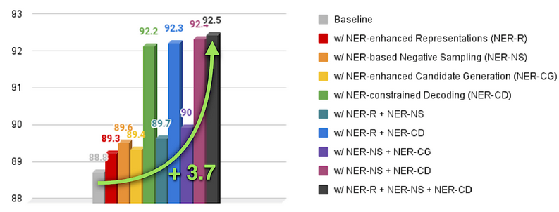
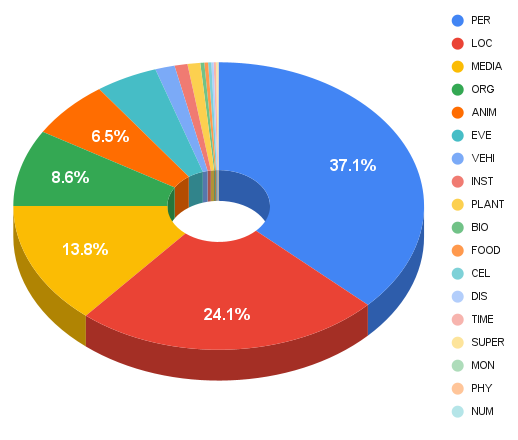

[](https://paperswithcode.com/sota/entity-disambiguation-on-ace2004?p=named-entity-recognition-for-entity-linking)
[](https://paperswithcode.com/sota/entity-disambiguation-on-aquaint?p=named-entity-recognition-for-entity-linking)
[](https://paperswithcode.com/sota/entity-disambiguation-on-msnbc?p=named-entity-recognition-for-entity-linking)
[](https://paperswithcode.com/sota/entity-disambiguation-on-wned-cweb?p=named-entity-recognition-for-entity-linking)	
[](https://paperswithcode.com/sota/entity-disambiguation-on-wned-wiki?p=named-entity-recognition-for-entity-linking)
[](https://paperswithcode.com/sota/entity-disambiguation-on-aida-conll?p=named-entity-recognition-for-entity-linking)


--------------------------------------------------------------------------------

Code and resources for the paper [Named Entity Recognition for Entity Linking: What Works and What's Next](https://aclanthology.org/2021.findings-emnlp.220/).

This repository is mainly built upon [Pytorch](https://pytorch.org/) and [Pytorch-Lightning](https://pytorch-lightning.readthedocs.io/en/latest/).

## Reference
**Please cite our work if you use resources and/or code from this repository.**
#### Plaintext
Simone Tedeschi, Simone Conia, Francesco Cecconi and Roberto Navigli, 2021. **Named Entity Recognition for Entity Linking: What Works and What's Next**. *In Proceedings of the 2021 Conference on Empirical Methods in Natural Language Processing (Findings of EMNLP 2021)*. Punta Cana, Dominican Republic. Association for Computational Linguistics.

#### Bibtex
```bibtex
@inproceedings{tedeschi-etal-2021-named-entity,
    title = "{N}amed {E}ntity {R}ecognition for {E}ntity {L}inking: {W}hat Works and What{'}s Next",
    author = "Tedeschi, Simone  and
      Conia, Simone  and
      Cecconi, Francesco  and
      Navigli, Roberto",
    booktitle = "Findings of the Association for Computational Linguistics: EMNLP 2021",
    month = nov,
    year = "2021",
    address = "Punta Cana, Dominican Republic",
    publisher = "Association for Computational Linguistics",
    url = "https://aclanthology.org/2021.findings-emnlp.220",
    pages = "2584--2596",
    abstract = "Entity Linking (EL) systems have achieved impressive results on standard benchmarks mainly thanks to the contextualized representations provided by recent pretrained language models. However, such systems still require massive amounts of data {--} millions of labeled examples {--} to perform at their best, with training times that often exceed several days, especially when limited computational resources are available. In this paper, we look at how Named Entity Recognition (NER) can be exploited to narrow the gap between EL systems trained on high and low amounts of labeled data. More specifically, we show how and to what extent an EL system can benefit from NER to enhance its entity representations, improve candidate selection, select more effective negative samples and enforce hard and soft constraints on its output entities. We release our software {--} code and model checkpoints {--} at https://github.com/Babelscape/ner4el.",
}
```

# Named Entity Recognition for Entity Linking: An Introduction
In this work we focus on **Entity Linking (EL)**, a key task in NLP which aims at associating an ambiguous textual mention with a named entity in a knowledge base. It is a very **knowledge-intensive task** and current EL approaches requires massive amounts of training data – often millions of labeled items – in order to perform at their best, making the development of a high-performance EL system viable only to a **limited audience**. Hence, we study whether it is possible to **narrow the performance gap** between systems trained on limited (i.e., less than 20K labeled samples) and large amounts of data (i.e., millions of training samples). In particular, we take a look at **Named Entity Recognition (NER)** – the task of identifying specific words as belonging to predefined semantic types such as Person, Location, Organization – and how this task can be exploited to **improve a strong Entity Linking baseline in low-resource settings** without requiring any additional data. We show how and to what extent an EL  system can benefit from NER to enhance its entity  representations, improve candidate selection, select more  effective negative samples and enforce hard and soft  constraints on its output entities.

<div align="center">



</div>


<br>

# Fine-Grained Classes for NER
In its standard formulation, NER distinguishes between four classes of entities: Person (PER), Location (LOC), Organization (ORG), and Miscellaneous (MISC).
Although NER systems that use these four classes have been found to be beneficial in downstream tasks, we argue that they might be too coarse-grained and, at the same time, not provide a sufficiently exhaustive coverage to also benefit EL, as many different entities would fall within the same Misc class.

For these reasons, **we introduce a new set of 18 finer-grained NER classes**, namely, Person (PER), Location (LOC), Organization (ORG), Animal (ANIM), Biology (BIO), Celestial Body (CEL), Disease (DIS), Event (EVE), Food (FOOD), Instrument (INST), Media (MEDIA), Monetary (MON), Number (NUM), Physical Phenomenon (PHYS), Plant (PLANT), Supernatural (SUPER), Time (TIME) and Vehicle (VEHI).

In order to use the newly introduced NER classes, we **automatically** label each Wikipedia entity with one of them by taking advantage of [WordNet](https://wordnet.princeton.edu/) and [BabelNet](https://babelnet.org/).

You can **download** the resulting mapping here: [Wikipedia2NER-mapping](https://drive.google.com/file/d/1tnyYe1alAPP2L866bUq4MtUh687z7oE4/view?usp=sharing) (158MB).

The following table plot shows the percentage of Wikipedia articles for each of the 18 NER classes.

<div align="center">



</div>

<br>

# Other Resources
Here you can download other resources needed to run the code, but also useful for other purposes (e.g., as a starting point for other EL projects).

<center>

| Resource | Description |
| ------------- | :------------- |
| [Alias Table](https://drive.google.com/file/d/13iro8M2KVONWANcgna_3zxxPZl9b7TVC/view?usp=sharing) (732MB) | A dictionary that associates each textual mention with a set of possible candidates <br>(i.e., a set of possible Wikipedia IDs)|
| [Descriptions Dictionary](https://drive.google.com/file/d/1kv1yxbrqvNgONcjuu2XNaoDrs6acOs4t/view?usp=sharing) (2.7GB) | A dictionary that associates each Wikipedia ID with its textual description|
| [Counts Dictionary](https://drive.google.com/file/d/1uKAO2866GAwVYdq1Rda6v-C2TZvoWOoZ/view?usp=sharing) (222MB) | A dictionary that associates each Wikipedia ID with its frequency in Wikipedia <br>(i.e., the sum of all the wikilinks that refer to that page)|
| [Titles Dictionary](https://drive.google.com/file/d/1hoUfhfNTP_73mcrYoWVBrwHQ8RXP2OSY/view?usp=sharing) (178MB) | A dictionary that associates the title of a Wikipedia page with its corresponding Wikipedia ID|
| [NER Classifier](https://drive.google.com/file/d/1SNXL_UvJ1RWzQaFOKZusfimIMgFQ5LAy/view?usp=sharing) (418MB) | The pretrained NER classifier used for the NER-constrained decoding and NER-enhanced candidate generation contributions (place it into the ner4el/wandb folder)|

</center>

<br>

# Data
The only training data that we use for our experiments are the training instances from the **AIDA-YAGO-CoNLL** training set. We evaluate our systems on the **validation** split of **AIDA-YAGO-CoNLL**.
For **testing** we use the test split of **AIDA-YAGO-CoNLL**, and the **MSNBC**, **AQUAINT**, **ACE2004**, **WNED-CWEB** and **WNED-WIKI** test sets.

We preprocessed the datasets and converted them in the following format:
<center>

```python
{"mention": MENTION, "left_context": LEFT_CTX, "right_context": RIGHT_CTX, "output": OUTPUT}
```
</center>

The preprocessed datasets are already available in this repository:
- [AIDA-YAGO-CoNLL (Train)](./ner4el/data/aida_train.jsonl)
- [AIDA-YAGO-CoNLL (Dev)](./ner4el/data/aida_dev.jsonl)
- [AIDA-YAGO-CoNLL (Test)](./ner4el/data/aida_test.jsonl)
- [MSNBC](./ner4el/data/msnbc_test.jsonl)
- [AQUAINT](./ner4el/data/aquaint_test.jsonl)
- [ACE2004](./ner4el/data/ace2004_test.jsonl)
- [WNED-CWEB](./ner4el/data/cweb_test.jsonl)
- [WNED-WIKI](./ner4el/data/wiki_test.jsonl)

<br>

# Pretrained Model
We release the model checkpoint of the best NER4EL system [here](https://drive.google.com/file/d/1CbjbknVYiON11xV1rOZto5mumbPov0z4/view?usp=sharing) (4.0GB). We underline that we trained our system only on the 18K training instances provided by the **AIDA-YAGO-CoNLL** training set. If you want to obtain a stronger EL system using our architecture you can pretrain it on BLINK (9M training instances from Wikipedia). You can download the BLINK train and validation splits as follows:
```python
wget http://dl.fbaipublicfiles.com/KILT/blink-train-kilt.jsonl
wget http://dl.fbaipublicfiles.com/KILT/blink-dev-kilt.jsonl
```

**Note**: We re-implemented the code using the [nn-template](https://github.com/lucmos/nn-template) and trained the system on a different hardware architecture. Although the obtained results are, on average, almost identical to those reported in the paper, they are slightly different. Please, find below the performance of the released system:

<center>

| System | AIDA | MSNBC | AQUAINT | ACE2004 | CWEB | WIKI | Avg. |
| ------------- | -------------: | -------------: | -------------: |  -------------: | -------------: | -------------: | -------------: |
| Paper (Baseline + NER-R + NER-NS + NER-CD) | 92.5 | 89.2 | 69.5 | 91.3 | 68.5 | 64.0 | 79.16 |
| Released system (Baseline + NER-R + NER-NS + NER-CD) | 93.6 | 89.1 | 70.6 | 91.0 | 67.2 | 63.7 | 79.20 |
</center>


<br>

# How To Use
To run the code, after you have downloaded the above listed resources and put them into the right folders as specified by the README files inside the folders, you need to perform the following steps:

0. Set the PROJECT_ROOT variable in the [.env](.env) file (it should correspond to the absolute path of the ner4el/ner4el folder)

1. Install the requirements:
    ```
    pip install -r requirements.txt
    ```
    The code requires **python >= 3.8**, hence we suggest you to create a conda environment with python 3.8.

2. Move to the ner4el folder and run the following command to train and evaluate the system:
    ```
    PYTHONPATH=. python src/run.py
    ```

3. If you want to test a trained system (e.g., the **NER4EL pretrained model** available in the previous section), run the command:
    ```
    PYTHONPATH=. python src/test.py
    ```
    Once the script is started, it asks you to specify the path of your model checkpoint.

**Note**: If you want to **change the system configuration**, you need to move in the *ner4el/conf* folder and change the parameters of your interest. As an example, if you move to the [data configuration file](./ner4el/conf/data/default.yaml), you can set the *training, evaluation and test sets*, but you can also specify the *number of candidates* you want to use, as well as the *context window*. At lines 10-14, you can also choose which *NER-based contribution* you want to apply on the baseline system, by setting it to *True*.
Similarly, in the [training configuration file](./ner4el/conf/train/default.yaml), you can specify the *number of epochs*, the *value of patience parameter*, and the number of *gradient accumulation steps*.

<br>

# License 
NER4EL is licensed under the CC BY-SA-NC 4.0 license. The text of the license can be found [here](https://github.com/Babelscape/wikineural/blob/master/LICENSE).

<br>

# Acknowledgments
We gratefully acknowledge the support of the **ERC Consolidator Grant MOUSSE No. 726487** under the European Union’s Horizon 2020 research and innovation programme.

The code in this repository is built on top of [](https://github.com/lucmos/nn-template).
